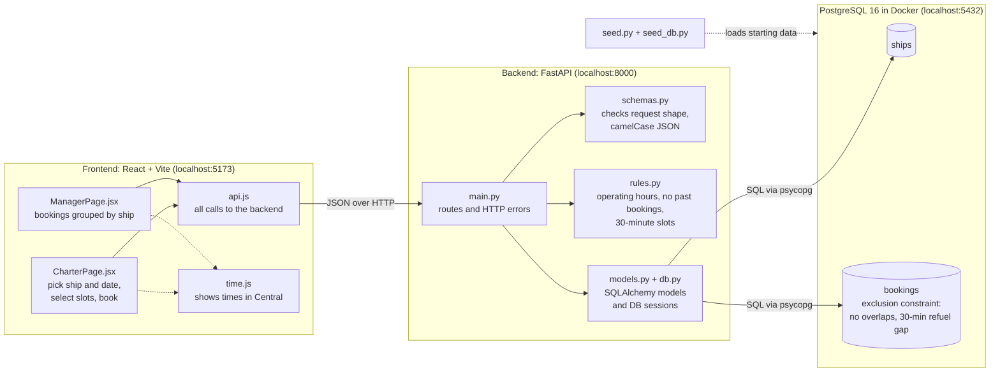
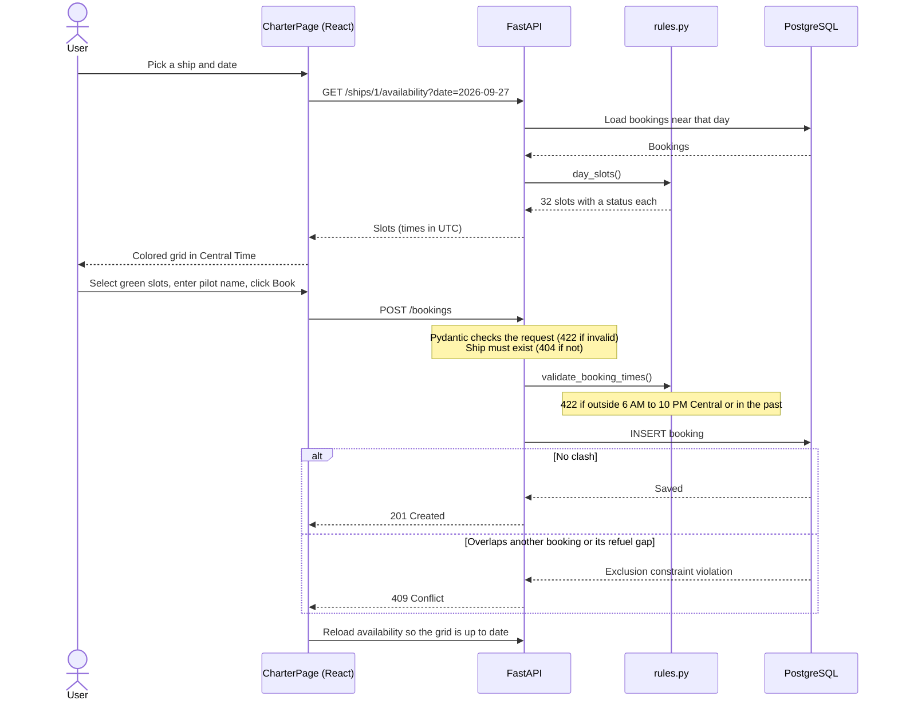

# Spaceport Charter System

A booking app for the Pacific Spaceport's charter fleet. It has two screens:

- **Charter a Ship** – pick a ship and a date, see what's free, and book a time.
- **Fleet Manager** – see bookings for every ship in a date range (the next 7 days by default), grouped by ship. Click a ship to open its list.

The original brief is in [ASSIGNMENT.md](ASSIGNMENT.md).

**Stack:** React + Vite on the frontend, FastAPI + SQLAlchemy on the backend, PostgreSQL in Docker for the database, and pytest for tests.

## Architecture

There are three parts: the React app in the browser, the FastAPI backend, and PostgreSQL. The frontend only displays things and sends requests, the backend checks the rules, and the database has the final say on overlapping bookings.



### What happens when someone books



### Where each rule is checked

| Rule | Checked in | Response if broken |
|---|---|---|
| Request has the right fields, a pilot name, and times with a timezone | `schemas.py` | 422 |
| Ship exists | `main.py` | 404 |
| Ends after it starts, not in the past, within 6 AM–10 PM Central | `rules.py` | 422 |
| No overlap with another booking on the same ship, 30-minute refuel gap | Postgres exclusion constraint (`models.py`) | 409 |

### Project layout

```
├── docker-compose.yml      Postgres 16
├── seed.py                 seed data generator from the brief
├── backend/
│   ├── app/
│   │   ├── main.py         API routes
│   │   ├── schemas.py      request and response models
│   │   ├── rules.py        booking rules and slot building
│   │   ├── models.py       tables and the exclusion constraint
│   │   └── db.py           database connection
│   ├── seed_db.py          loads the seed data
│   └── tests/              rule tests and API tests
└── frontend/src/
    ├── App.jsx             navigation and routes
    ├── api.js              calls to the backend
    ├── time.js             Central Time formatting
    └── pages/              CharterPage.jsx, ManagerPage.jsx
```

## How to run it

You'll need Docker, Python 3.12+ and Node 20+.

Start the database:

```bash
docker compose up -d
```

Set up and start the backend (these are Windows paths; on Mac/Linux use `.venv/bin/python`):

```bash
cd backend
python -m venv .venv
.venv\Scripts\python -m pip install -r requirements.txt
.venv\Scripts\python seed_db.py
.venv\Scripts\python -m uvicorn app.main:app --reload
```

The API runs on http://localhost:8000, and http://localhost:8000/docs has a page where you can try each endpoint.

`seed_db.py` recreates the tables and loads the data from `seed.py`. You can run it again any time to reset everything.

Then, in a second terminal, start the frontend:

```bash
cd frontend
npm install
npm run dev
```

Open http://localhost:5173.

To run the tests (the database needs to be running):

```bash
cd backend
.venv\Scripts\python -m pytest
```

The tests use their own `spaceport_test` database, so they won't touch your data.

## API

- `GET /ships` – list of ships
- `GET /ships/{id}/availability?date=2026-09-27` – that day's half-hour slots from 6 AM to 10 PM Central, each marked `available`, `booked`, `refueling` or `past`
- `GET /bookings?fromDate=&toDate=` – bookings sorted by ship, optionally filtered by date (`shipId` works as a filter too)
- `POST /bookings` – create a booking with `shipId`, `pilotName`, `startTime` and `endTime`

When booking, you get back `201` if it worked, `404` if the ship doesn't exist, `422` if the request breaks a rule (outside hours, in the past, no timezone, and so on) and `409` if the time clashes with another booking.

## How I used AI

I used Claude Code as a pair-programming tool during development. It helped accelerate project setup, generate initial implementations for some components, explore technical approaches, and troubleshoot issues as they came up.

I owned the overall solution and made the key implementation decisions, including selecting PostgreSQL, structuring the backend and frontend, defining the booking and availability flow, and implementing the 30-minute refueling rule. I reviewed and modified the generated code throughout development rather than using it as-is, and worked through technical issues such as PostgreSQL range constraints and timezone-aware booking logic.

I also tested the application end-to-end, validated booking conflicts and edge cases, refined the UI and user flow, and reviewed the final codebase to ensure I understood and could explain each part of the implementation. AI was useful for speeding up development and discussing alternatives, while the final design decisions, validation, and project ownership remained mine.

## What I'd do next

- Add migrations (Alembic) instead of recreating tables
- Let the fleet manager cancel or edit bookings
- Keep the refueling time in one place only
- Add pagination or a calendar view on the Fleet Manager
- Add some frontend tests for the slot selection
- Put the whole app in Docker Compose so it starts with one command
